# media-studio-release

## Introduction

Media Studio is a tool that assists content creators and social media influencers with media asset processing. The main features include:

**Video Processing**

- Leverage Google NotebookLM to generate audio and video content. According to predefined formats and specifications, this software can automatically upload local materials to NotebookLM, then automatically download the generated audio and video files.
- Remove NotebookLM video watermark logos and replace them with your own.
- Extract audio from any video file to create a podcast program.
- Assemble multiple short videos into a long-form video, ideal for creating video compilations.

**Image Processing**

- Convert PNG images to Apple macOS icns format.
- Image scaling. Conveniently reduce high-resolution images for uploading to mainstream media platforms.
- Add watermarks to images. Add custom text watermarks at any position on images.
- Remove watermarks from images. Currently supports removing watermarks from Doubao-generated images.

## User Guide

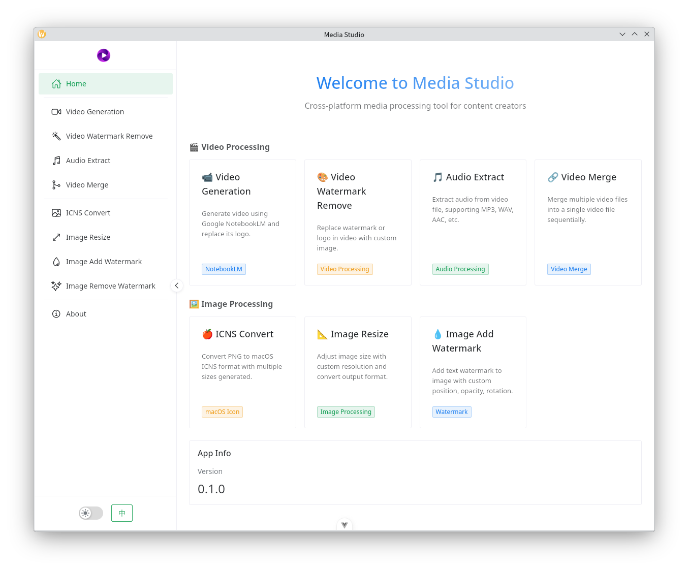

### Video Generation

1. If not logged in, click the "Login" button on the interface. This will open a built-in browser where you can log in to Google's NotebookLM service. The browser will automatically close once login is successful.
2. Select the project material directory, which is the directory containing your local materials. The software will search for a `notebooklm.md` file to guide Google NotebookLM on how to generate audio and video according to specification. If this file does not exist, no audio or video will be generated. Click [here](./spec.md) to view the `notebooklm.md` specification.
3. Select the output directory. This step is optional. If left empty, the generated audio and video files will be stored in an `outputs` directory within the materials directory. If you specify a directory, the files will be output to that location.
4. The bottom section is the task management interface where you can manage individual tasks or manage tasks in batches.
    1. The buttons above each task progress bar are for managing that specific task.
    2. The "Delete Remote Notebooks" button in the upper right requires batch task selection to take effect. It will delete Notebooks from Google NotebookLM. Note that this batch management feature only applies to Notebooks created by MediaStudio. Notebooks created by other software or manually created in the web interface cannot be managed.
    3. The adjacent "Clear MediaStudio Notebooks" button will delete all Notebooks created by this software on Google NotebookLM. Because multiple task submissions or retry attempts on the same materials create new Notebooks on Google NotebookLM, over time the number of Notebooks can become very large. Since Notebooks created by this software follow a specific naming pattern, this button can quickly clean up all these Notebooks.

**Reminder**
- Material uploads are very fast. Depending on the amount of material, uploads typically complete within 1 to several minutes.
- Google NotebookLM generates audio and video relatively slowly. Audio generation takes several minutes to over ten minutes, while video generation takes 20 to 60 minutes. Please be patient. The software will automatically detect generation progress and download the files once generation is complete.

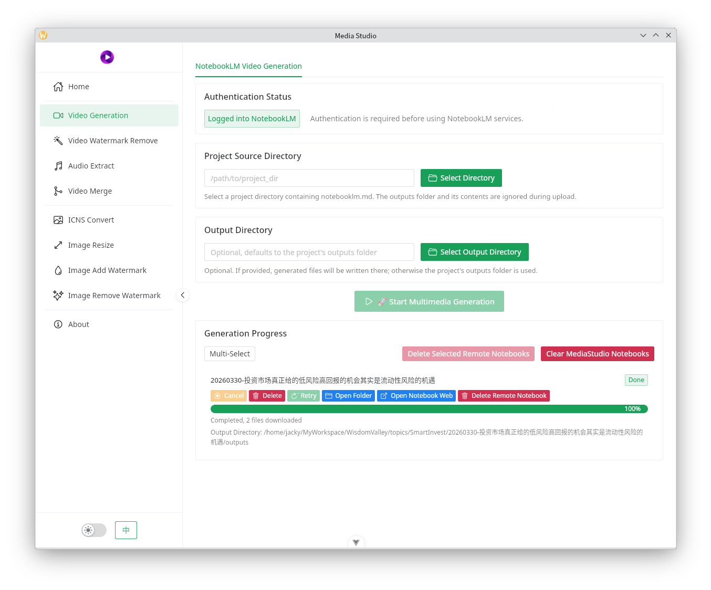

### Remove Video Watermark

This feature primarily removes the Google NotebookLM logo watermark from video files.

- If your computer has an NVIDIA graphics card configured, enabling GPU acceleration will provide faster processing. The software currently does not support other graphics cards.
- Repair algorithm options include the default Telea, which is generally sufficient for most cases. The image below shows the results using this algorithm. If you require higher precision, select NS.
- End logo animation duration: Generally, Google NotebookLM generated videos have an end logo duration of approximately 2 seconds. Using a 2-second custom image here will perfectly replace it. If the source video has a different end logo duration, you can adjust this time to match.

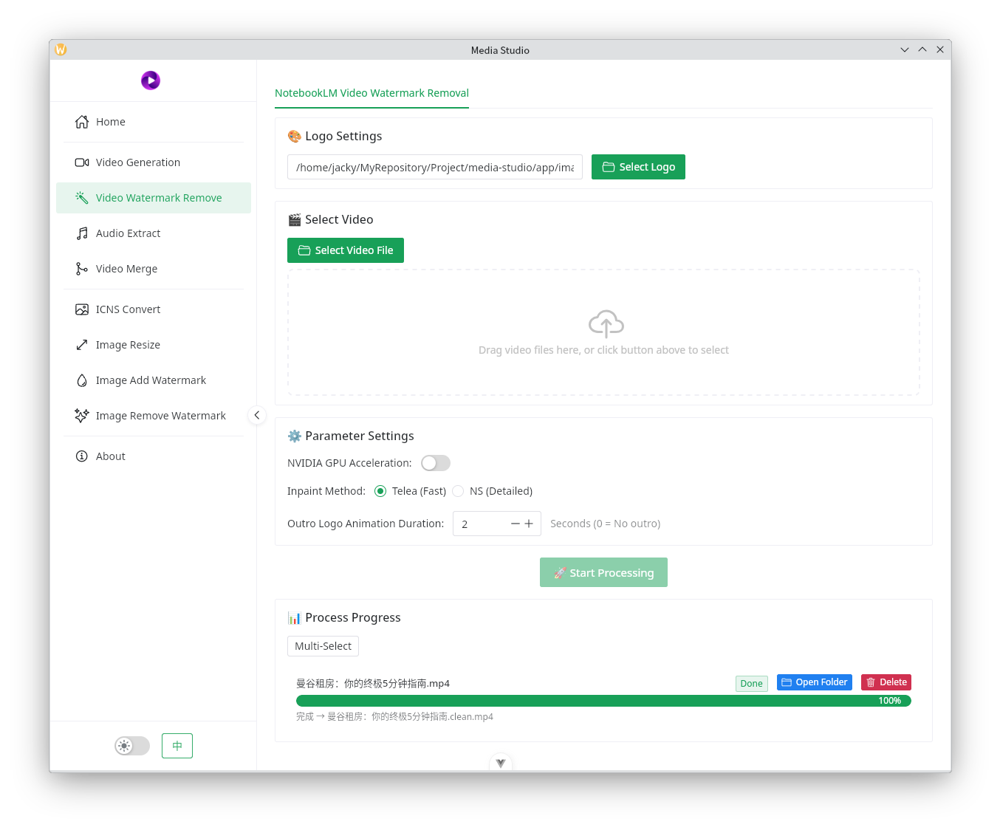

For example, here are the watermark effects of Google NotebookLM generated video. The two images below show the logo effects in the middle and end of the video respectively.

Here are the effects after processing:

### Audio Extraction

This feature can extract audio from common video files.

1. MP4 files work best - audio can be instantly extracted into m4a format.
2. To extract other audio formats, additional time is needed for intermediate transcoding.
3. If no output path is specified, the audio will be output to the same directory as the video file.

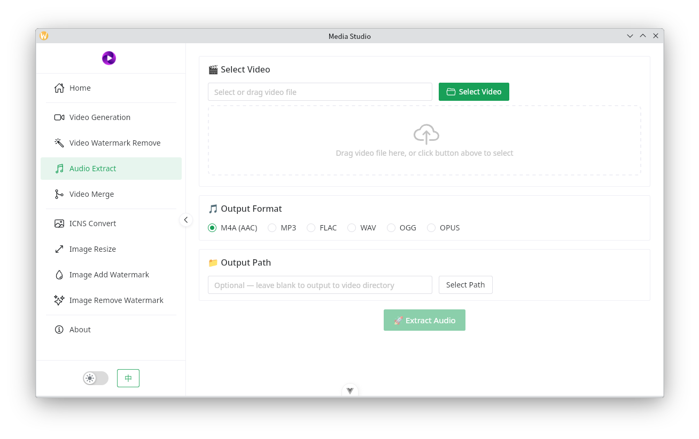

### Video Composition

Select the videos you need to process, then adjust their order to merge them into a single video. This is commonly used in social media video distribution to avoid detection and for creating video compilations.

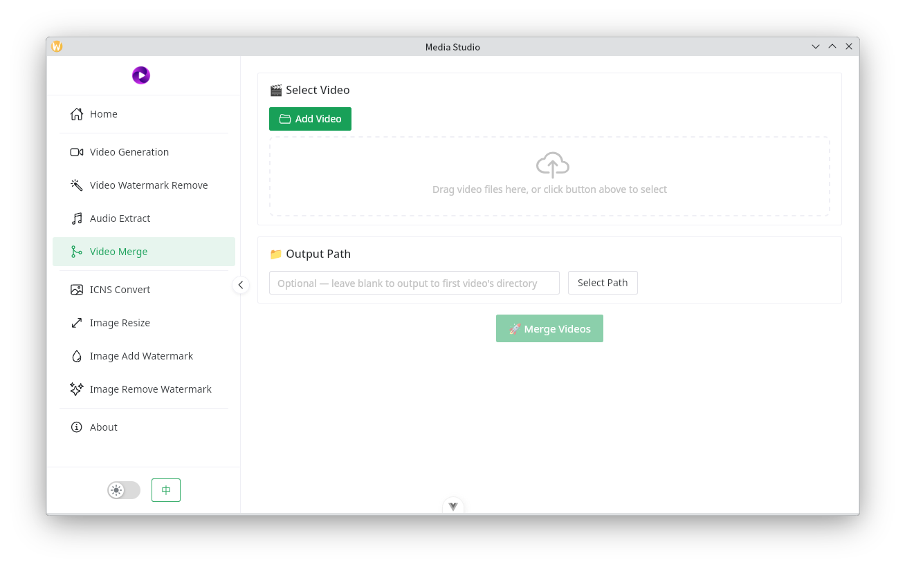

### ICNS Conversion

As the name suggests, this converts PNG images to macOS icns format, commonly used as icons for iOS and macOS applications.

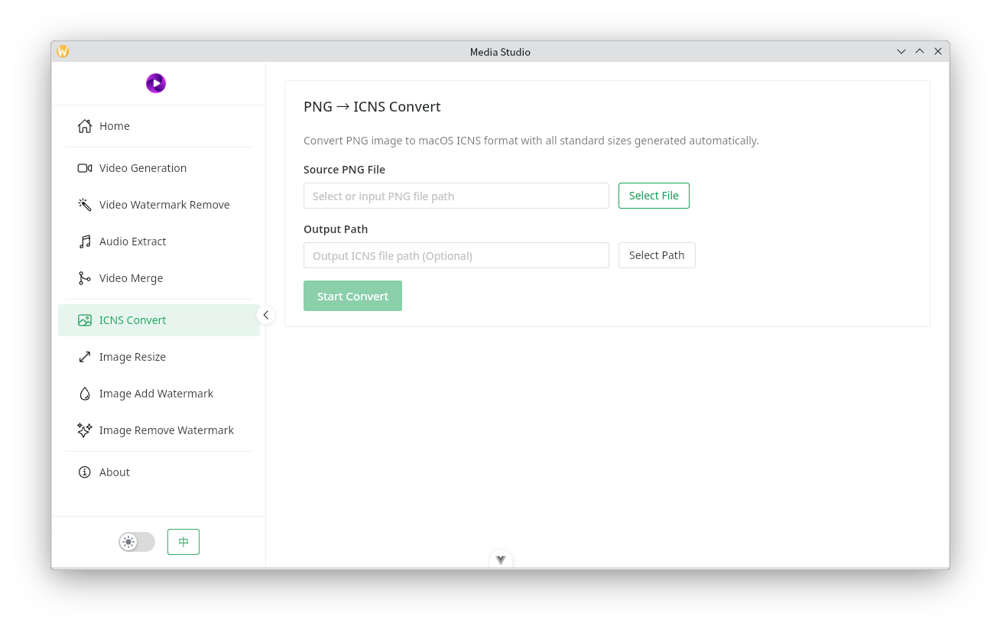

### Image Scaling

When uploading images to Zhihu, Little Red Book, various blogging platforms, and other sites, there are often image size restrictions. This feature conveniently reduces image sizes to meet requirements.

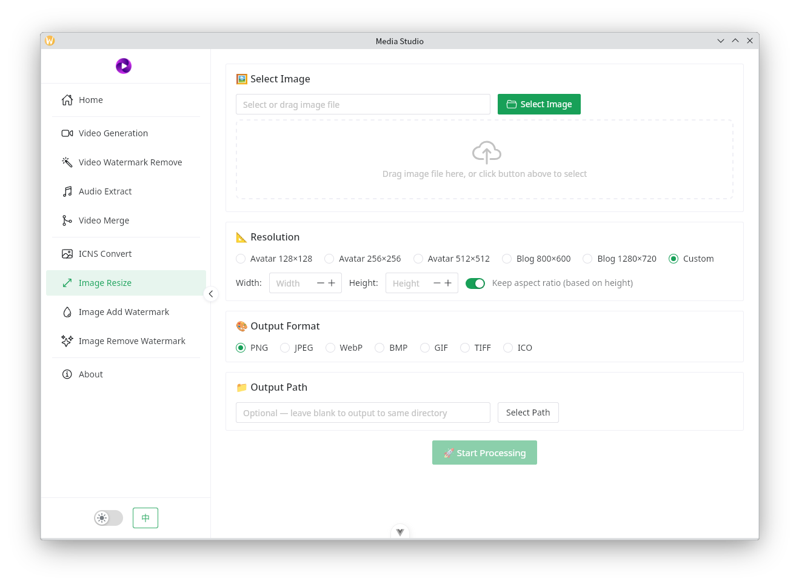

### Add Image Watermark

This feature allows adding text watermarks at any position on an image. It supports font color, transparency, and rotation angle, but watermarks are text-only.

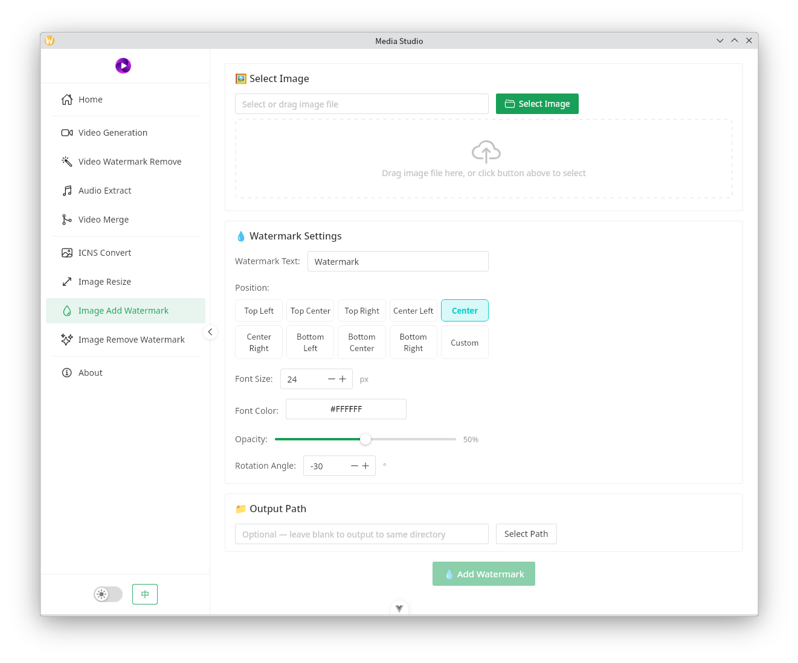

### Remove Image Watermark

Currently mainly removes watermarks from Doubao-generated images. The default parameters in the interface can already achieve the effect shown in the image below. If your situation differs, you can adjust the parameters to match.

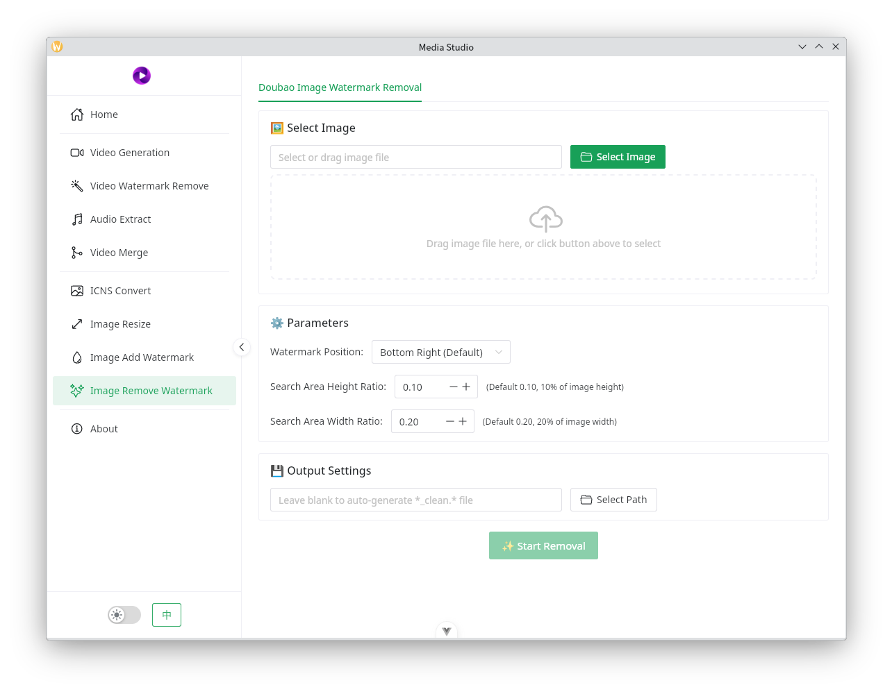

Below is the effect demonstration:

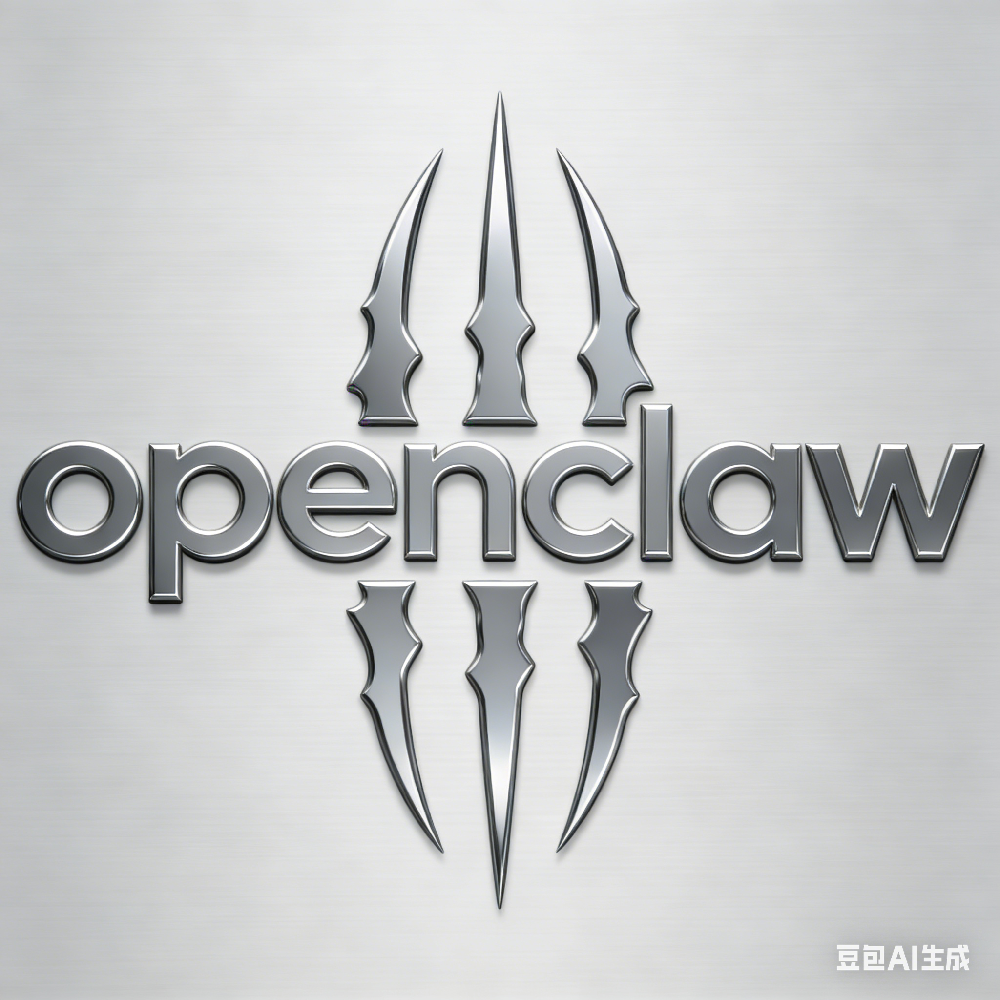

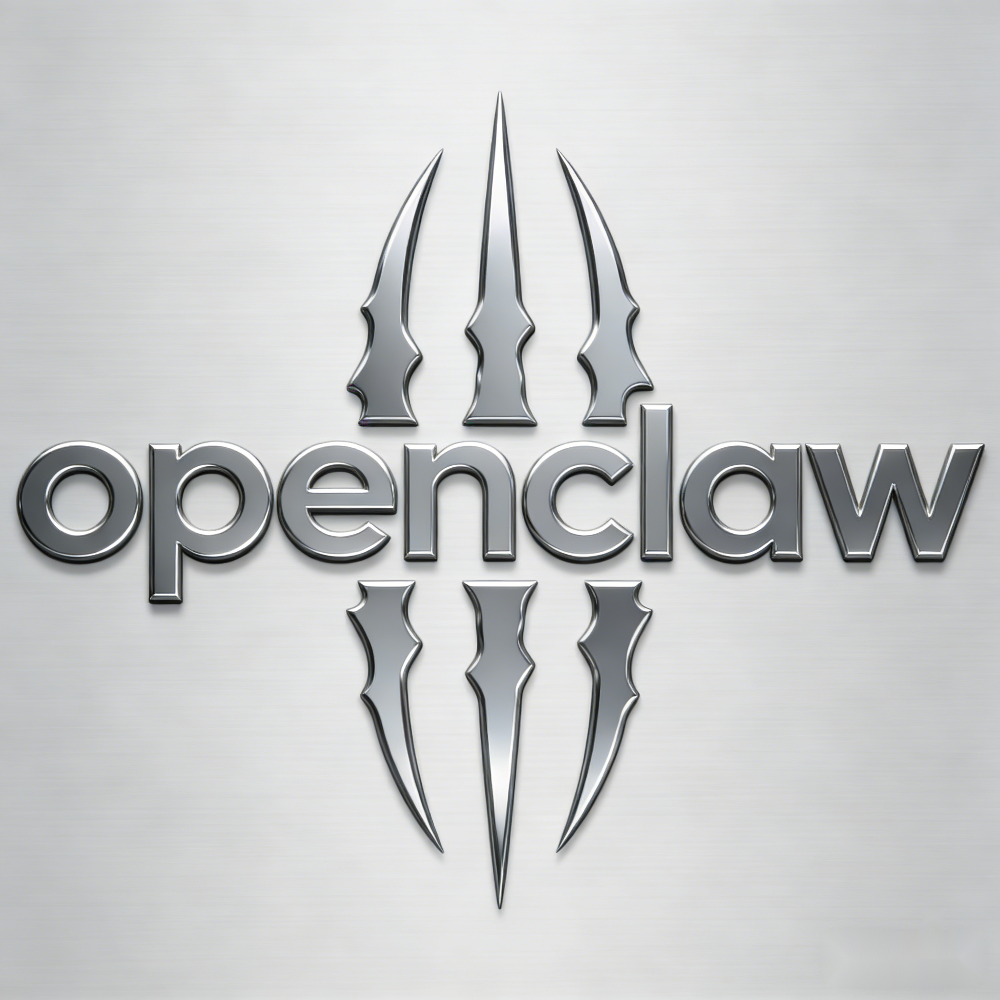
