# media-studio-release | [EN](README.en.md)

## 软件介绍

自媒体助手（Media Studio）是一款辅助自媒体博主处理媒体素材的工具，主要的功能有

视频处理

- 利用 Google NotebookLM 生成音频和视频。按照既定的格式指定生成的音视频规格，本软件可以自动上传本地素材到NotebookLM，然后自动下载生成好的音视频。
- 能够去除 NotebookLM 视频的水印logo，并换成自己的logo。
- 能够从任意视频文件中提取音频，做成播客节目。
- 能够将多个短视频组装成长视频，适合做视频专辑。

图片处理

- 将PNG图片转换成苹果电脑的icns格式。
- 图片缩放。便于将高清图片缩小后上传到各主流媒体平台。
- 图片加水印。在图片的任意位置添加自定义文字作为水印。
- 图片去水印。目前支持对豆包生成的图片去除水印。

## 软件使用说明

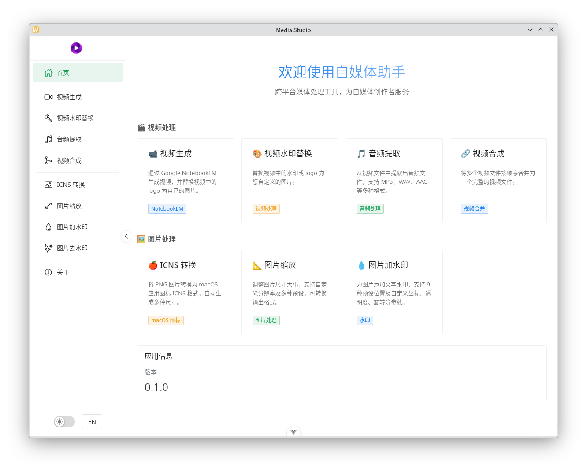

### 视频生成

1. 未登录情况下，请点击界面里的“登录”按钮，随后会弹出本软件自带的浏览器让用户登录Google的NotebookLM服务，登录成功后浏览器会自动关闭。
2. 选择项目资料目录，即本地素材所在的目录，本软件会从中寻找`notebooklm.md`文件作为指导Google的NotebookLM如何生成音视频的规范文件，如果该文件不存在则不会触发后续的流程生成任何音视频。点击 [这里](./spec.md) 查看`notebooklm.md`规范。
3. 选择输出目录，该步骤是可选的，如果留空，则会在素材目录下面outputs目录里存放生成的音视频文件。如果指定目录，那么音视频文件就会输出到指定位置。
4. 最下方的是任务管理界面，可以管理单个任务，也可以批量管理任务
    1. 每个任务进度条上方的按钮都是管理本任务的。
    2. 右上角的“删除远程Notebooks”则是需要批量选择任务后才能生效，它会删掉Google NotebookLM上的Notebooks。需要注意的是，这个批量管理功能只适用于由MediaStudio创建的Notebooks，由其他软件或者用户手动在web界面上创建的Notebooks无法被管理。
    3. 旁边的“清空 MediaStudio Notebooks”则是将本软件在Google NotebookLM上创建的所有的Notebooks全都删掉。由于多次对同一份素材提交任务或者失败任务重试都会在Google NotebookLM上创建新的Notebook，时间一长，Notebooks的数量就会变得很多，但由于由本软件创建的Notebook的名字都有特定的规律，所以，该按钮可以一键清理掉这些Notebooks。

提醒
- 素材的上传非常快速，根据素材量的多少，一般在1分钟到几分钟的时间内就可以完成。
- Google NotebookLM生成音视频的速度会比较慢，音频的生成需要几分钟到十几分钟的时间，视频的生成需要20分钟到60分钟的时间，需要耐心等待。本软件会自动检测生成的进展，一旦生成完毕，本软件就可以将他们都下载回来。

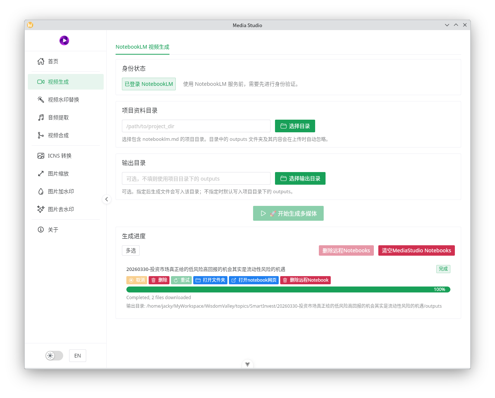

### 视频去水印

本功能主要是将Google NotebookLM生成的视频文件中的Logo水印去除。

- 如果你的电脑配置了NVIDIA显卡，那么启动显卡加速可以获得更快的速度。本软件还不支持其他显卡。
- 修复算法，可以选择默认的Telea，一般情况下足够应对，下面图片的效果就是该算法下生成的，倘若你要求更高精度，那么选择NS。
- 片尾logo动画时长，一般情况下 Google NotebookLM 生成的视频的片尾logo时长差不多是2秒钟，所以，这里使用2秒的自定义图片刚好替换。如果源视频的片尾logo时长有变化，就可以调节这个时间去适配。

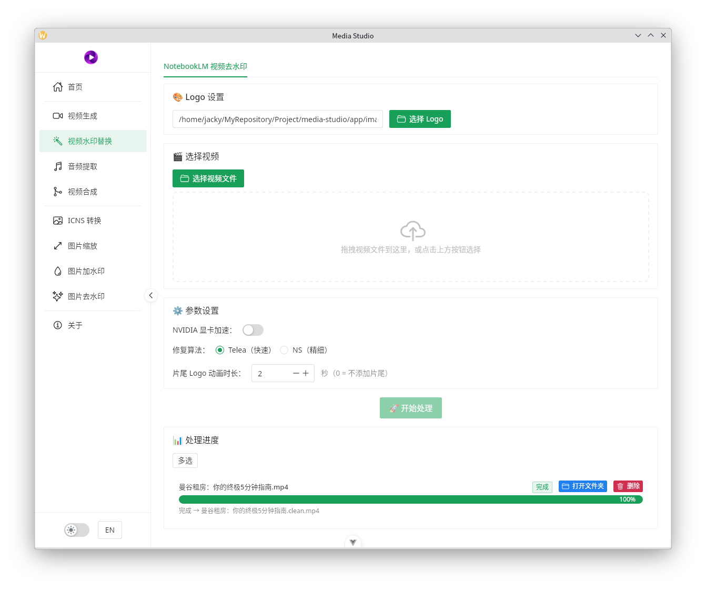

比如这是Google NotebookLM生成的视频的水印效果，2个图分别表示视频中间和视频尾部的logo效果，
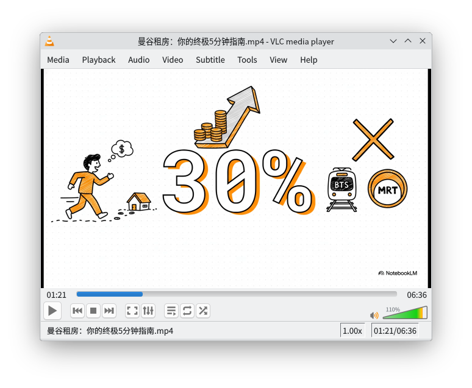
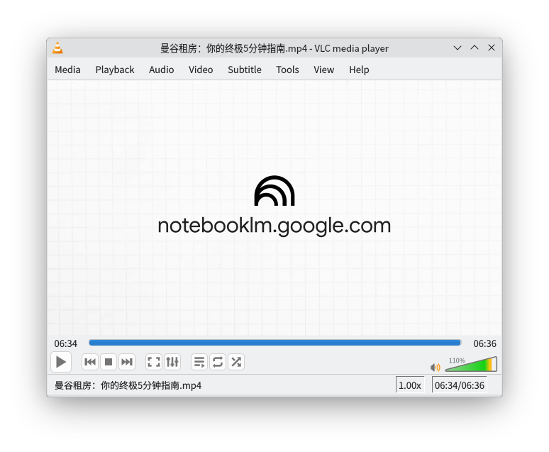

这是经处理后的视频的效果，
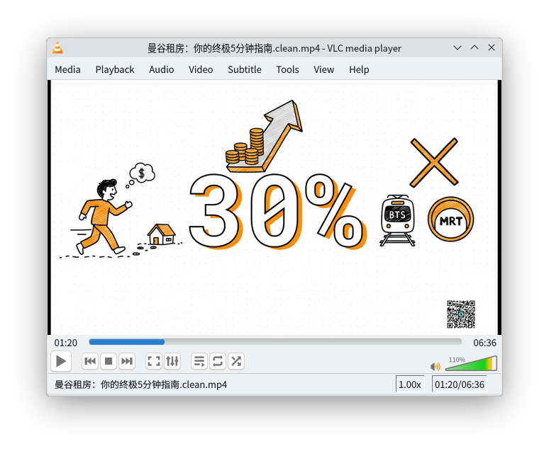

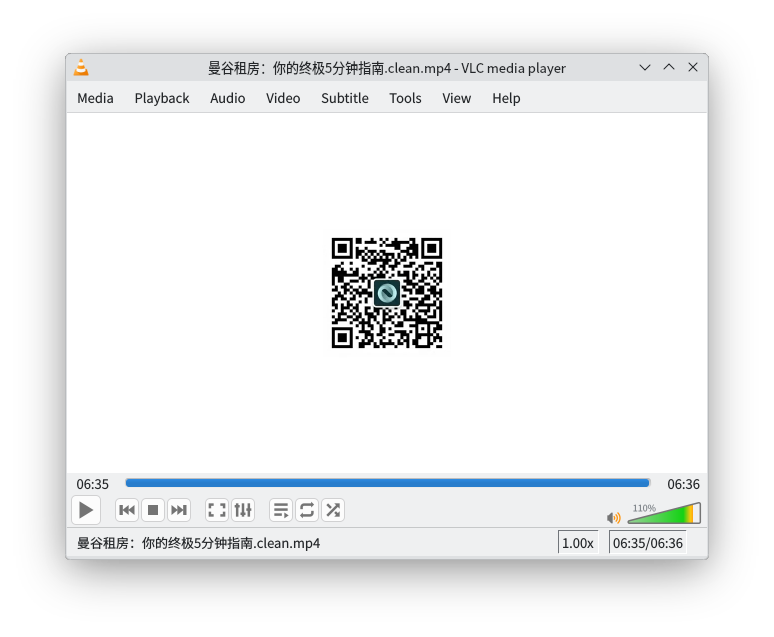

### 音频提取

本功能可以从常见的视频文件中提取音频

1. 适配最好的是mp4文件，瞬间就可以从中抽取出m4a音频。
2. 如果要抽取其他音频格式，则需要一些额外的时间做中间转码。
3. 如果不指定输出路径的话，则会输出到视频文件同级目录里。

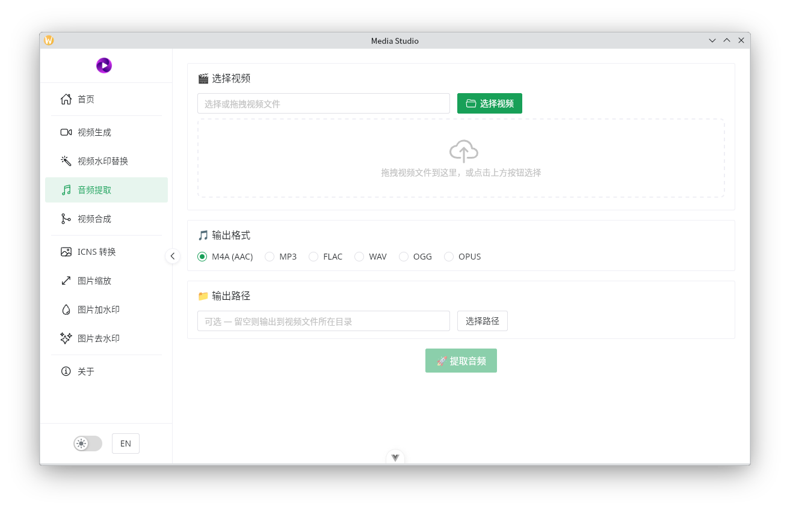

### 视频合成

选择需要处理的视频，然后调整顺序，就可以将他们合并为一个整体的视频。这种情况在自媒体视频搬运防检测和视频合集生成场景下很常见。

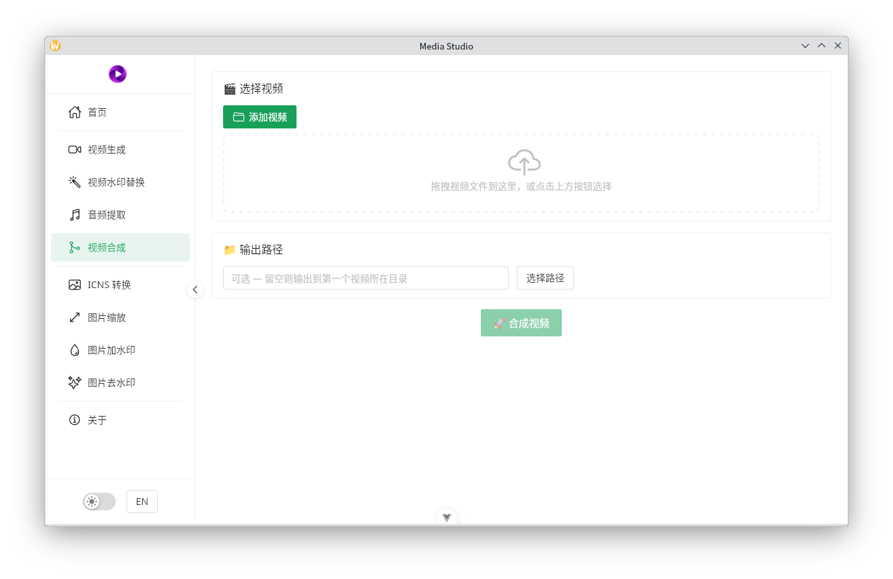

### ICNS转换

顾名思义，就是将PNG图片转换成macOS系统的icns格式，这种格式常用作 iOS 和 macOS App的图标。

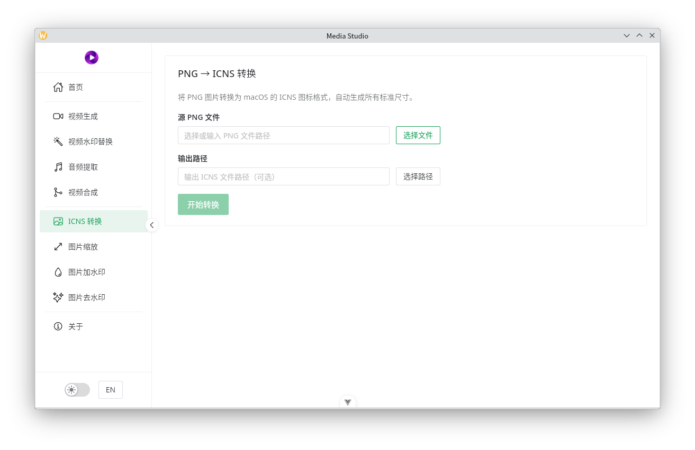

### 图片缩放

当我们要在知乎、小红书、各类博客站点发送图片的时候，总是会有图片大小的限制，该功能可以很方便地将图片缩小以适配。

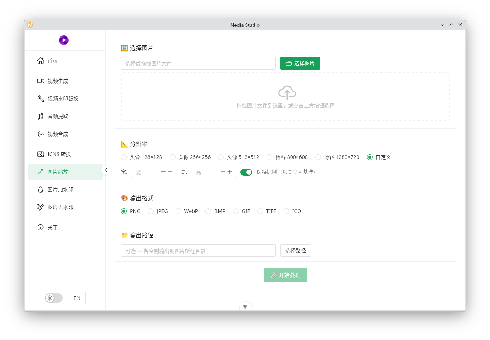

### 图片加水印

该功能可以在图片的任意位置添加文字水印，支持字体颜色、透明度、旋转角度，但水印只支持文字。

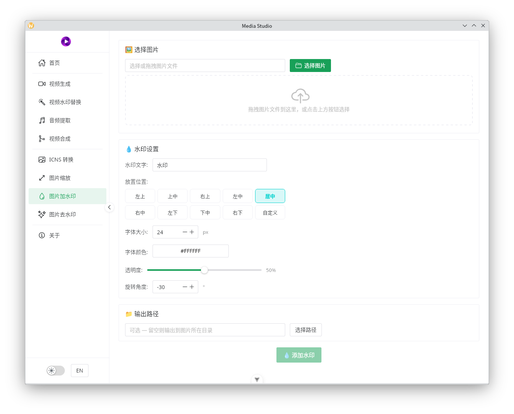

### 图片去水印

目前主要是去除豆包生成图片里的水印。界面里的默认参数已经可以实现下图里的效果，如果情况有不同，则可以调整里面的参数以适配。

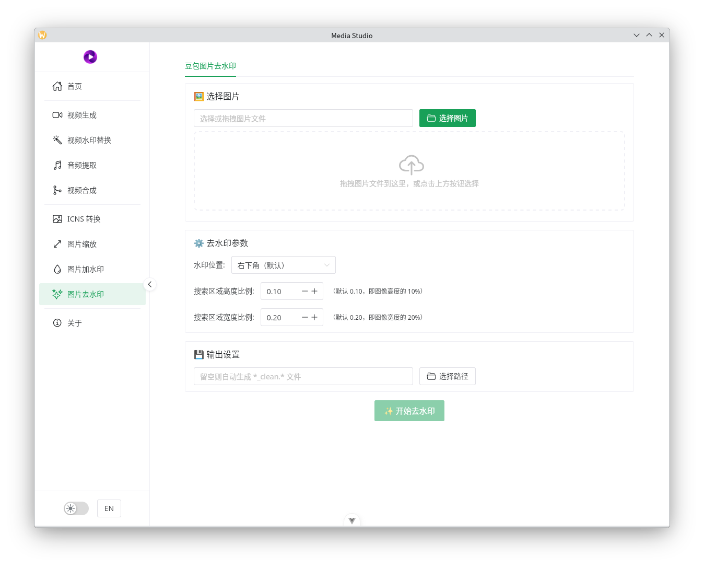

下面是效果展示

